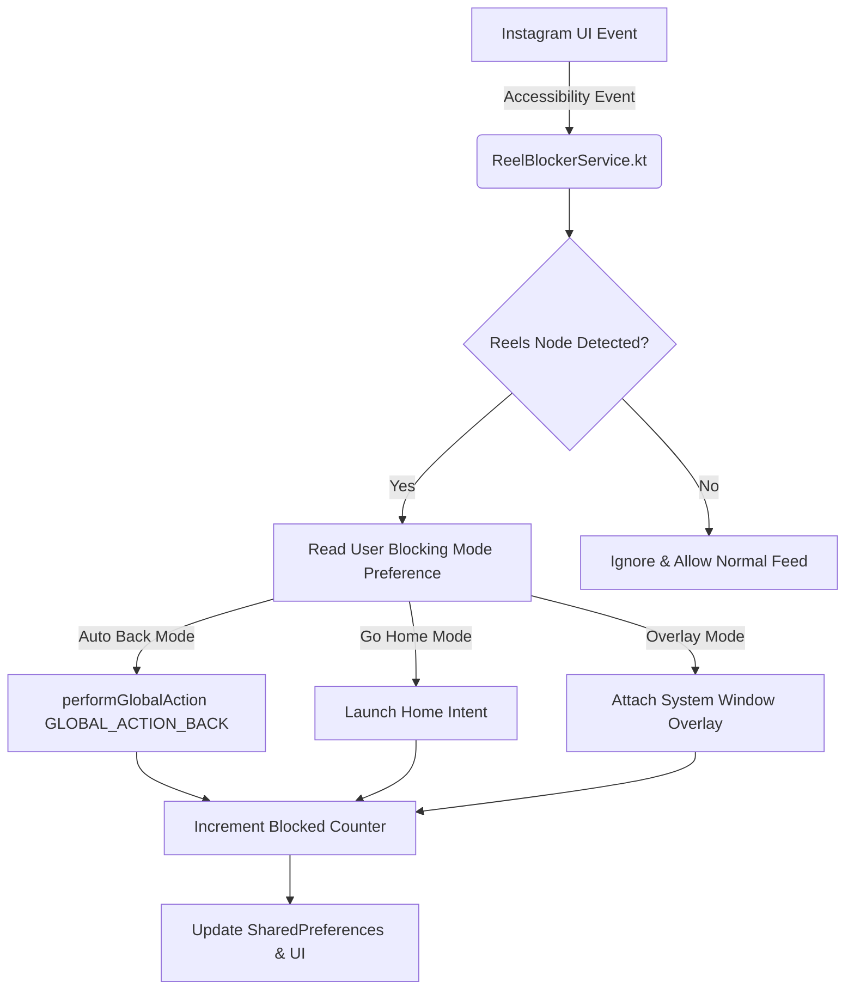

# 🛡️ ReelLock — Instagram Reels Blocker for Android

[-3DDC84?style=for-the-badge&logo=android&logoColor=white)](https://developer.android.com)
[](https://kotlinlang.org)
[](LICENSE)
[](https://sohamtilekar.github.io/ReelLock/)
[](CHANGELOG.md)

> **ReelLock** is a lightweight, open-source Android digital wellbeing application designed to block Instagram Reels in real time, preventing doomscrolling and helping users reclaim their focus and time.

---

## 📸 Key Features & Blocking Modes

ReelLock features real-time UI node tree analysis using Android Accessibility Services, intercepting Instagram Reels the exact millisecond they render.

| Blocking Mode | Description | Action Triggered |
| :--- | :--- | :--- |
| ↩️ **Auto Back** | Instantly triggers the Android system back button when a Reel opens. | Returns user to feed/previous view. |
| 🏠 **Go to Home Screen** | Instantly closes Instagram and sends you to your device home screen. | Redirects to launcher. |
| ⛔ **Custom Blocker Overlay** | Renders an unbypassable full-screen alert overlay over the video player. | Displays alert view. |

---

## 🏗️ System Architecture



---

## 🚀 Quick Start & Installation

### Option A: Install Pre-Built Binary
1. Download the latest release APK (`ReelLock-v1.0.0.apk`) from [GitHub Releases](https://github.com/ReelLock/ReelLock/releases).
2. Install the APK on your Android device.
3. Open ReelLock, tap **Enable Accessibility Service**, and turn on **ReelLock**.
4. (Optional) Tap **Grant Overlay Permission** if using Full Overlay Mode.

### Option B: Build Release APK from Source
```bash
# Clone the repository
git clone https://github.com/ReelLock/ReelLock.git
cd ReelLock

# Compile Release APK
./gradlew assembleRelease
```
The compiled binary will be located at:
`app/build/outputs/apk/release/app-release-unsigned.apk` (or signed binary `app-release.apk`).

---

## 🌐 Documentation Hosted on GitHub Pages

Technical documentation is automatically built with MkDocs and hosted on **GitHub Pages**:
👉 **[https://sohamtilekar.github.io/ReelLock/](https://sohamtilekar.github.io/ReelLock/)**

Guides available in the docs:
- 📖 [User Setup Guide](docs/user-guide.md)
- 🏗️ [Architecture Deep-Dive](docs/architecture.md)
- ⚙️ [Building, Signing & GitHub Release Publishing Manual](docs/building.md)
- 🔋 [OEM Battery Saver Fixes (Xiaomi, Samsung, OnePlus)](docs/faq.md)
- 📅 [Development Timeline (Jan 28 – Feb 13, 2026)](TIMELINE.md)

---

## 🔒 Security & Privacy First

- 🚫 **Zero Network Permissions**: ReelLock does not request `android.permission.INTERNET`. No personal data ever leaves your device.
- 🔒 **No Keyboard or Text Reading**: ReelLock strictly inspects view resource IDs and container class names to identify Reels video players.

---

## 📬 Contact & Support

For questions, support, or security concerns:
- **Email**: `sohamtilekar233+reellock@gmail.com`
- **Issue Tracker**: [GitHub Issues](https://github.com/ReelLock/ReelLock/issues)

---

## 🤝 Contributing & Community

Contributions are welcome! Please check out our [CONTRIBUTING.md](CONTRIBUTING.md) and adhere to our [CODE_OF_CONDUCT.md](CODE_OF_CONDUCT.md).

---

## 📄 License

Distributed under the MIT License. See [`LICENSE`](LICENSE) for more information.
