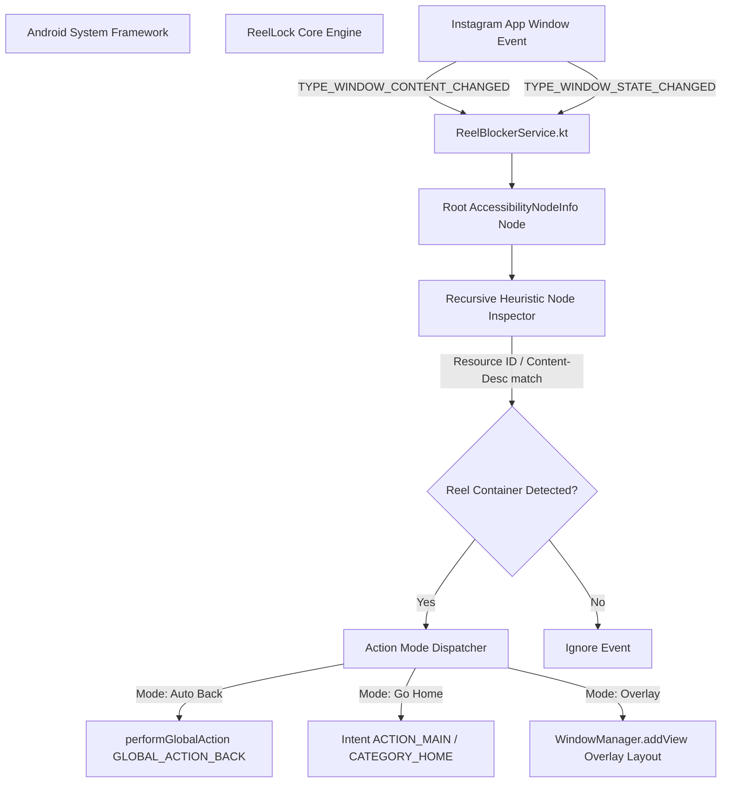

# Architecture Deep-Dive

ReelLock leverages Android's `AccessibilityService` API to inspect window hierarchy changes in real-time, specifically monitoring Instagram's process tree (`com.instagram.android`).

---

## High-Level System Architecture

---

## Key Components

### 1. `ReelBlockerService.kt`
- Extends `android.accessibilityservice.AccessibilityService`.
- Configured via `accessibility_service_config.xml` to filter events from `com.instagram.android`.
- Overrides `onAccessibilityEvent(event: AccessibilityEvent)`.

### 2. Node Traversal Heuristic
Instagram dynamically obfuscates view resource IDs across updates. ReelLock employs multi-layered heuristic checks:
1. **ClassName Inspection**: Identifies `Reels` surface views and video container view groups.
2. **Resource-ID & Content-Description Matching**: Looks for keywords such as `clips_viewer`, `reels_tab`, `reels_video_container`, and related content descriptions.
3. **View Structure Parsing**: Recursively traverses `AccessibilityNodeInfo` tree roots.

### 3. Action Execution Engine
When a positive match occurs, `ReelBlockerService` executes the user's selected mode:
- **`MODE_AUTO_BACK`**: Calls `performGlobalAction(GLOBAL_ACTION_BACK)`.
- **`MODE_GO_HOME`**: Launches an Intent with `Intent.ACTION_MAIN` and `Intent.CATEGORY_HOME`.
- **`MODE_OVERLAY`**: Inflates `overlay_reels_blocked.xml` and adds it to the system window manager using `TYPE_APPLICATION_OVERLAY`.

---

## Data Persistence & Security Model

- **SharedPreferences**: Stores mode preferences (`key_block_mode`) and block counts (`key_block_count`).
- **Privacy Assurance**: ReelLock reads zero text fields, credentials, or personal messages. It strictly inspects node layout structures matching Reels video players.
