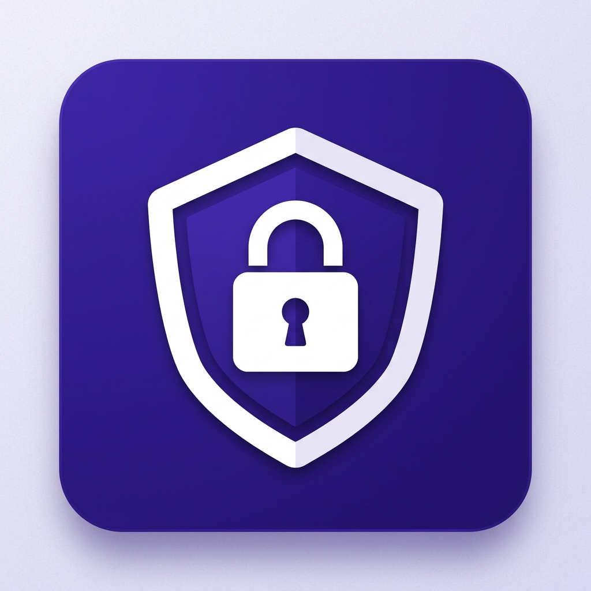
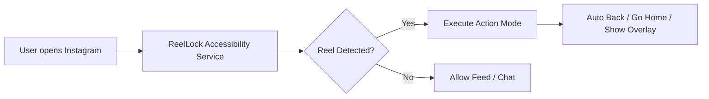

  

# Welcome to ReelLock

**ReelLock** is an open-source Android digital wellbeing application engineered to detect and block Instagram Reels in real time, helping users eliminate infinite scrolling and reclaim focus.

---

## Key Features

- 🎯 **Precision Real-Time Detection**: Powered by an Android Accessibility Service targeting package `com.instagram.android`.
- ⚡ **3 Blocking Modes**:
  1. **Auto Back**: Instantly triggers the Android system back button when a Reel opens.
  2. **Go Home**: Instantly returns you to your launcher home screen.
  3. **Full-Screen Overlay**: Displays an unbypassable blocking alert window over the Reels view.
- 📊 **Block Statistics**: Local tracking of how many times ReelLock intercepted Reels.
- 🔒 **Zero Data Collection & Offline Security**: No Internet permission required (`INTERNET`). All node tree analysis occurs 100% locally on your device.

---

## How It Works

---

## Quick Navigation

- 📖 [User Setup Guide](user-guide.md): Step-by-step instructions to grant system permissions.
- 🏗️ [Architecture Overview](architecture.md): Deep-dive into accessibility node inspection logic.
- ⚙️ [Building & Compilation](building.md): How to build ReelLock from source using Android Studio and Gradle.
- ❓ [FAQ & OEM Fixes](faq.md): Solutions for Xiaomi, Samsung, and OnePlus background battery saver issues.
